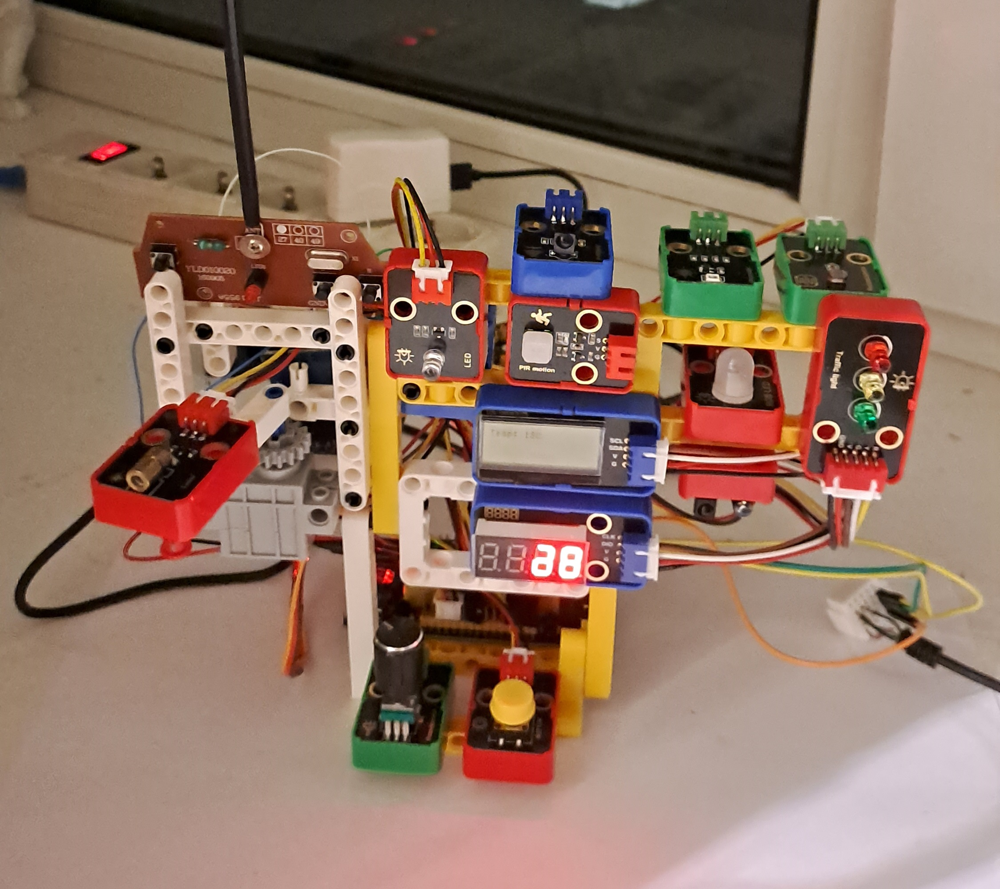

# Домашний робот на RP2040

В основе робота положен микроконтроллер RP2040 на плате Raspberry Pi Pico.  
Двухъядерный процессор Arm Cortex M0+

Многоцелевой домашний робот состоит из:
- радиопередатчика 28 МГц для управления машинкой;
- GPS-модуля (для получения координат и точного времени) - подключен по UART;
- сервомотора для наведения лазерного светодиода;
- лазерного светодиода;
- активного пьезоизлучателя для звуковой индикации;
- семисегментного индикатора на 4 цифры KETM1650;
- дисплея LCD 128x32;
- датчика температуры и влажности XHT11 (в комнате);
- датчика температуры DS18B20 (за окном);
- фоторизистора;
- светодиодной индикации.

Робот подключается по UART к Wi-Fi модулю ESP01S и через него подключается к локальной сети.

- Написан на языке C++ Arduino

Статус проекта: Разрабатывается.

Copyright (c) 2024 Evgeny Goryachev  
Gor.Com 